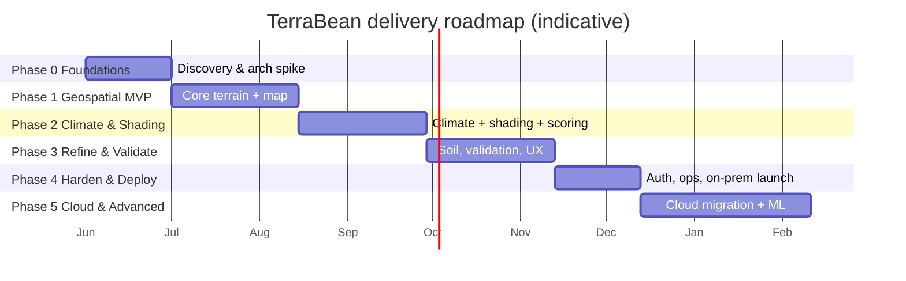

# 07 — Roadmap & Phases

A phased plan from discovery to an operating on-prem tool, with a defined path to cloud.
Durations are planning estimates for a full cross-functional team and should be refined
in Phase 0 once the region(s), data resolution, and concurrency are confirmed.

## Phase 0 — Discovery & Foundations  *(~4 weeks)*
**Goal:** de-risk the unknowns and stand up the engineering foundation.
- Confirm operating region(s), expected users/concurrency, and success metrics.
- **Agronomy workshop:** fix the suitability thresholds/weights with the co-op's experts ([doc 03](03-suitability-model.md)).
- **Data spike:** evaluate DEM/climate resolution against real plot sizes; pick datasets; confirm licenses ([doc 06](06-data-sources.md)).
- Architecture spike on the heaviest geoprocessing step (terrain shading over a polygon).
- Scaffold repo, CI/CD, container baselines, dev environment ([doc 09](09-development-setup.md)).
- Assemble the validation/ground-truth dataset (start early — it gates Phase 3).
- **Exit:** thresholds agreed, datasets chosen, CI green, "walking skeleton" deploys locally.

## Phase 1 — Core Geospatial MVP  *(~6 weeks)*
**Goal:** point/polygon in → altitude/slope/aspect out, on a map.
- Ingestion pipeline for the pilot region (DEM → COG → PostGIS) ([doc 04](04-architecture.md)).
- API fast path (point) + async path (polygon) with Celery.
- Derive altitude, slope, aspect; zonal stats over polygons.
- Web app: AOI input (point/draw/upload), map display, basic result panel.
- Single-/few-factor suitability score (terrain only) to prove the scoring pipeline.
- **Exit:** an agronomist can drop a pin or draw a plot and see terrain-based results.

## Phase 2 — Climate & Shading  *(~6 weeks)*
**Goal:** the full v1 suitability model.
- Ingest climate normals; integrate NASA POWER / Open-Meteo for recent conditions.
- Temperature & rainfall factors, incl. rainfall-distribution modifier.
- Terrain shading / insolation (sky-view, hillshade, frost-pocket detection).
- Full weighted-overlay scoring with hard limits and limiting-factor reporting.
- Per-factor breakdown + provenance in the UI; PDF report export.
- **Exit:** complete v1 suitability rating with explanations for the pilot region.

## Phase 3 — Refinement & Validation  *(~6 weeks)*
**Goal:** make it trustworthy.
- Optional soil factor (SoilGrids).
- Canopy-shading estimate from land-cover/canopy data.
- **Validate against the ground-truth set**; tune weights/bands; hit the ≥ 80% agreement target.
- Agronomist controls: adjust weights/thresholds, record expert overrides; audit log.
- Batch assessment of multiple plots; save/compare.
- UX polish for non-GIS field officers.
- **Exit:** model meets the accuracy target; experts trust and use it.

## Phase 4 — Hardening & On-Prem Deployment  *(~4 weeks)*
**Goal:** production-ready inside the co-op.
- SSO (Keycloak/OIDC), roles, audit retention; security review.
- Observability (Prometheus/Grafana/Loki), health checks, backups + restore drill.
- Performance pass against NFR targets; load test.
- On-prem deployment via IaC (Terraform/Ansible), docs, and **staff training**.
- **Exit:** live on-prem, monitored, backed up, with trained users and runbooks.

## Phase 5 — Cloud Migration & Advanced  *(optional, ~8 weeks)*
**Goal:** scale and deepen — only if needed.
- Migrate to managed cloud k8s; swap MinIO→S3/GCS, Redis/Postgres→managed (per [ADR-0003](adr/0003-containerize-for-onprem-to-cloud-portability.md)).
- Optional **ML suitability layer** trained on the co-op's outcome data (alongside, never replacing, the explainable score).
- Climate-change scenario analysis (suitability shift under projected warming).
- Tablet/offline field mode.

## Cross-cutting (every phase)
Testing, documentation, security hygiene, accessibility, and stakeholder demos run
continuously — not as a final phase. Each phase ends with a working, demoable increment.
