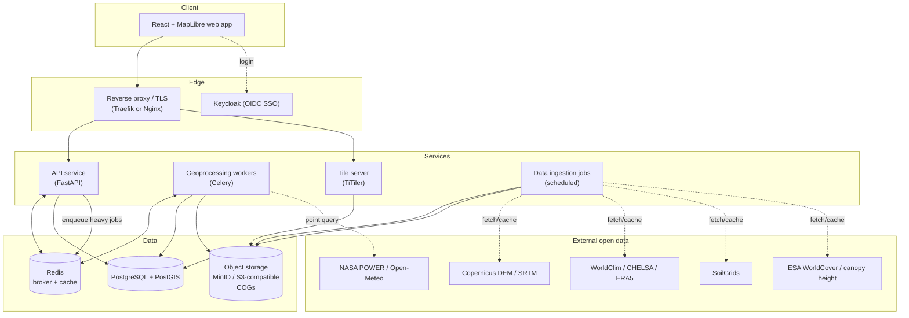
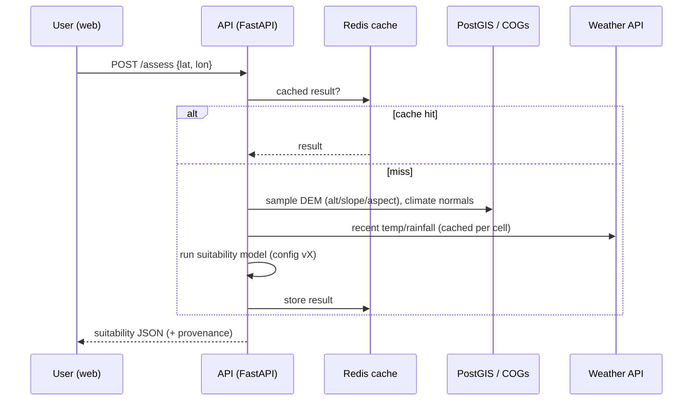
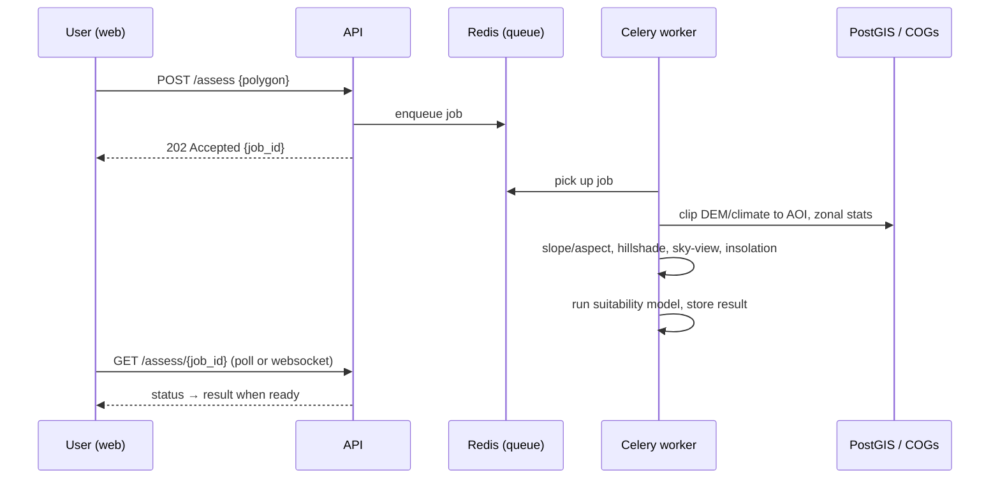

# 04 — Architecture

## Guiding principles

1. **Portable by default.** Containerized, open-source, vendor-neutral so on-prem → cloud
   is an infra change, not a rewrite (NFR-4/5/6, [ADR-0003](adr/0003-containerize-for-onprem-to-cloud-portability.md)).
2. **Async for heavy work.** Geoprocessing runs in workers off a queue; the API stays snappy (NFR-3).
3. **Cache aggressively.** Regional rasters are pre-processed once; point/weather lookups are cached.
4. **Explainable & reproducible.** Scoring config is versioned; every result records its provenance (NFR-14/16).
5. **Separation of concerns.** A shared geoprocessing library is used by both the API (fast point path) and workers (heavy polygon path).

## Component overview

## Request flows

### Fast path — single point
For a point, the answer is usually a set of lookups against pre-ingested regional rasters
plus a cached weather query, so it can be served synchronously.

### Heavy path — polygon AOI
For a polygon we run zonal statistics, terrain shading, and possibly canopy analysis —
too heavy to block a request, so it is queued.

## Components in detail

| Component | Responsibility |
|-----------|----------------|
| **Web app** | AOI input (point/draw/upload), map display (MapLibre), factor overlays, report export, override UI |
| **API (FastAPI)** | AuthN/Z, request validation, fast point path, job orchestration, results API, config management |
| **Geoprocessing library** | Shared Python module: raster sampling, slope/aspect, hillshade/sky-view/insolation, zonal stats, suitability engine. Used by both API and workers |
| **Workers (Celery)** | Long-running polygon analysis, batch jobs, report rendering |
| **Tile server (TiTiler)** | Serve DEM/derivative/result rasters as web map tiles from COGs. Dev: reachable on `:8001`; production fronts api+titiler behind a single **Caddy** origin (auto-TLS, served by the GCP demo deploy per [ADR-0009](adr/0009-gcp-single-vm-demo-deployment.md); on-prem equivalent is nginx + certbot). The browser never picks the COG URL itself — the API's `/overlays` endpoint hands it a TiTiler-ready tile template per dataset, with provenance and colormap baked in (FR-13, [ADR-0008](adr/0008-titiler-raster-overlays.md)) |
| **Reverse proxy / edge** | **Caddy** (demo deploy, per [ADR-0009](adr/0009-gcp-single-vm-demo-deployment.md)) or nginx (on-prem) terminates TLS and reverse-proxies a single public origin to `api:8000` (`/api/*`), `titiler:80` (`/tiles/*`), and the built SPA (`/`). Single-origin design collapses CORS to nothing and lets the backend hand out relative URLs |
| **Data ingestion** | Scheduled jobs that fetch, reproject, tile, and store DEM/climate/soil/land-cover as Cloud-Optimized GeoTIFFs for the supported region(s); refresh weather caches |
| **PostGIS** | Plots/AOIs, assessment results, audit log, model config versions, vector layers |
| **Object storage (MinIO)** | COG rasters; S3-compatible so cloud migration = endpoint swap |
| **Redis** | Celery broker + result cache |
| **Keycloak** | OIDC SSO, roles (viewer/agronomist/admin) |
| **Observability** | Prometheus (metrics), Grafana (dashboards), Loki (logs), health checks |

## Data strategy: pre-ingest, don't fetch-on-request

Global rasters (DEM, climate) are large. Rather than hitting external sources per request,
**ingestion jobs pre-process the co-op's region(s) of interest into COGs** stored in object
storage and indexed in PostGIS. Assessments then read from fast local storage. Only
**point weather observations** (NASA POWER / Open-Meteo) are fetched on demand and cached.
This is what keeps the fast path under 5 s and removes a hard runtime dependency on
external uptime (supports NFR-8 graceful degradation).

## On-prem → cloud migration path

Because every box above is a container and storage is S3-compatible:

| Concern | On-prem (start) | Cloud (later) |
|---------|-----------------|---------------|
| Orchestration | Docker Compose, then **k3s** | Managed Kubernetes (EKS/GKE/AKS) |
| Object storage | MinIO | S3 / GCS / Azure Blob (same API) |
| Database | PostGIS container | Managed Postgres + PostGIS |
| Queue/cache | Redis container | Managed Redis |
| Auth | Keycloak | Keycloak or managed OIDC |
| Provisioning | Terraform + Ansible | Terraform (swap provider) |

The migration is therefore incremental and low-risk — see [ADR-0003](adr/0003-containerize-for-onprem-to-cloud-portability.md).
